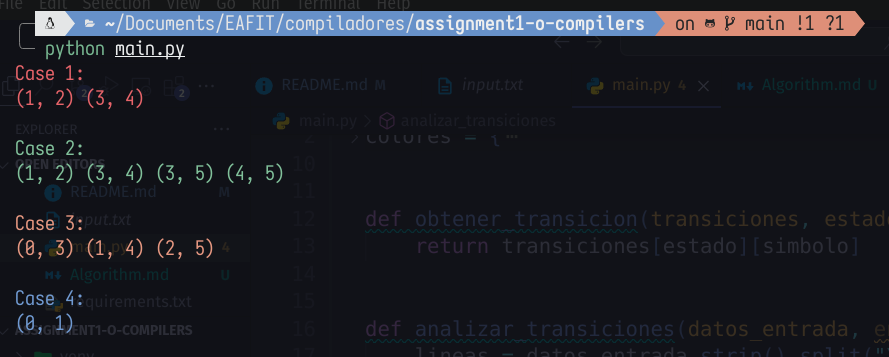

# Assignment 1 O Compilers 

[](https://classroom.github.com/a/WPMOLLWm)

## Screenshots

With test case from `input.txt` this is the result:



## Full names

- Juan Andrés Young Hoyos
- Samuel Enrique Rivero Urribarrí

## Versions

- Python Version: Python 3.12.2
Tested on
- Windows 11.
- Pop!_OS 22.04 LTS x86_64.
  - Kernel: 6.9.3-76060903-generic

## Detailed Instructions

Detailed Instructions for Running the Implementation (The repository includes a virtual environment for best practices, but it is unnecessary to run the `main.py` code). To run the implementation, follow these steps:

1. **Clone the repository**
   - Clone the repository using the following command:
     ```bash
     git clone repositoryURLorUseSSH
     ```
2. **Run `main.py` normally**
  ```bash
    # If you are using Windows use this command
    python main.py
    # If you are on Linux or any OS X machine use this line
    python3 main.py
  ```
Or you can use a virtual environment if you want to use a formatter like black:
  ```bash
    python3 -m venv venv
    source venv/bin/activate
    pip install -r requirements.txt
    python app/main.py
  ```

## Ethics

- We were having trouble creating the tuples because we were not forming the pairs as defined. Instead, we were only creating pairs that went from one state to another, which caused the first two cases not to work. However, with the help of ChatGPT, it now works for all cases.# Assigment1Compilers
